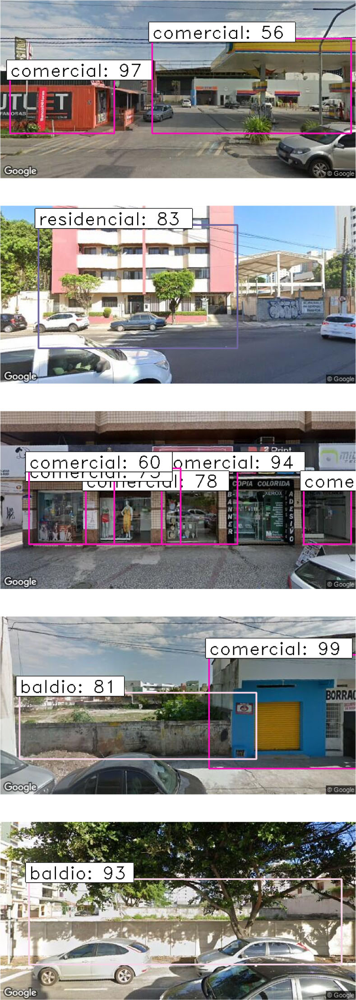

# An annotated image database of building facades categorized into land uses for object detection using deep learning  
*Author: Frederico Damasceno Bortoloti*

Semi-supervised Object Detection based on Faster R-CNN in PyTorch and TensorFlow 2 w/ Keras
*Copyright 2021-2022 Bart Trzynadlowski*

## Overview

<p align="center">
  
</p>

This is an implementation of the Faster R-CNN object detection model in both PyTorch and TensorFlow 2 with Keras, using Python 3.7 or higher. This code also implements semi-supervised learning to work of unlabeled images. 

The results using the VOC2007 dataset's 5011 `trainval` images match the paper's. Convergence is achieved in 14 epochs (10 epochs at a learning rate of 0.001 and 4 more at 0.0001), consistent with the learning schedule the paper used. This implementation includes only a VGG-16 backbone as the feature extractor.

| Class | Average Precision |
|-------|-------------------|
| cat        | 85.2% |
| car        | 84.5% |
| horse      | 84.1% |
| bus        | 81.8% |
| bicycle    | 81.6% |
| dog        | 81.1% |
| person     | 79.3% |
| train      | 78.2% |
| motorbike  | 76.8% |
| cow        | 75.8% |
| aeroplane  | 74.3% |
| tvmonitor  | 72.7% |
| sheep      | 69.1% |
| bird       | 68.2% |
| diningtable| 66.9% |
| sofa       | 64.9% |
| boat       | 55.3% |
| bottle     | 53.7% |
| chair      | 52.3% |
| pottedplant| 40.4% |
|**Mean**    | **71.3%** |

This project applies Faster R-CNN with other techniques to learn an annotated image database of building facades obtained from 
Google Street View, that categorizes objects into land uses (**residential**, **commercial**, **religious**, **public** and **vacant**) . The database is included in this repository, inside the 
`data` folder, in a compacted zip file.

For the detection of building facades, we tested the Faster R-CNN with different backbone networks as feature extractors
(VGG16, VGG16-Places365, VGG19, ResNet50, ResNet101, ResNet152),
and trained the model both from scratch and using pre-trained weights.

## Results

### a) The average mAP (in %) in 40 runs by 10 epochs for:

#### Faster R-CNN methods and one-shot methods SSD and RetinaNet on labeled data:

| Method                       | From scratch | -       | Pre-trained |-|
|------------------------------|--------------|---------|-------------|---|
| -                       | mAP (%)      | std (%) | mAP (%)     |std (%)|
| Faster R-CNN (VGG)           | 17.01        | 1.04    | 52.99       |2.43|
| Faster R-CNN (VGG-Places365) | 17.01        | 1.04    | 50.55       |3.23|
| Faster R-CNN (VGG19)         | 17.00        | 2.06    | 52.72       |3.33|
| Faster R-CNN (ResNet50)      | 19.02        | 3.08    | 58.99       |2.14|
| Faster R-CNN (ResNet101)     | 22.48        | 4.03    | **62.20**   |2.08|
| Faster R-CNN (ResNet152)     | **24.50**    | 6.58    | 57.04       |3.37|
| SSD                          | 57.21        | 0.60    |||
| RetinaNet                    | 51.92        | 0.15    |||

#### Faster R-CNN methods on unlabeled data are:

|Method|From scratch| -         |Pre-trained| -         |
|------|------------|-----------|-----------|-----------|
|-|mAP (%)| std (%)   |mAP (%)| std (%)   |
|Faster R-CNN (VGG)|17.53| 1.06      |54.32| 1.74      |
|Faster R-CNN (VGG-Places365)|17.53| 1.06      |49.55| 2.79      |
|Faster R-CNN (VGG19)|17.42| 1.39      |53.85| 2.40      |
|Faster R-CNN (ResNet50)|18.22| 2.60      |56.65| 4.50      |
|Faster R-CNN (ResNet101)|20.24| 3.64      |**60.13**| 2.87      |
|Faster R-CNN (ResNet152)|**21.85**| 4.08      |58.41| 2.91      |

### b) The average mAP (in %) in 10 runs by 100 epochs for:

#### Faster R-CNN methods and one-shot methods SSD and RetinaNet on labeled data:

|Method| From scratch | -       | Pre-trained |-|
|------|--------------|---------|-------------|-----|
|-| mAP (%)      | std (%) | mAP (%)     |std (%)|
|Faster R-CNN (VGG)| 63.98        | 2.47    | 85.17       |2.01|
|Faster R-CNN (VGG-Places365)| 65.60        | 4.09    | **86.07**   |1.10|
|Faster R-CNN (VGG19)| 60.16        | 2.77    | 85.25       |1.18|
|Faster R-CNN (ResNet50)| **66.19**    | 5.11    | 84.49       |3.18|
|Faster R-CNN (ResNet101)| 60.10        | 2.82    | 76.20       |6.50|
|Faster R-CNN (ResNet152)| 56.47        | 4.03    | 70.37       |2.70|
|SSD| 57.21        | 0.60    |||
|RetinaNet| 51.92        |0.15|||

#### Faster R-CNN methods on unlabeled data are:

|Method| From scratch |-| Pre-trained |-|
|------|--------------|----|-------------|----|
|-| mAP (%)      |std (%)| mAP (%)     |std (%)|
|Faster R-CNN (VGG)| 66.35        |3.89| 83.27       |5.27|
|Faster R-CNN (VGG-Places365)| **66.40**    |4.25| **86.53**   |1.06|
|Faster R-CNN (VGG19)| 64.38        |3.12| 85.85       |2.34|
|Faster R-CNN (ResNet50)| 62.86        |4.95| 78.97       |8.28|
|Faster R-CNN (ResNet101)| 57.83        |3.61| 73.40       |5.40|
|Faster R-CNN (ResNet152)| 57.19        |2.80| 68.66       |2.38|

## Background Material

Required literature for understanding Faster R-CNN:

- [*Very Deep Convolutional Networks for Large-Scale Image Recognition*](docs/publications/vgg16.pdf) by Karen Simonyan and Andrew Zisserman. Describes VGG-16, which serves as the backbone (the input stage and feature extractor) of Faster R-CNN.
- [*Fast R-CNN*](docs/publications/fast_rcnn.pdf) by Ross Girshick. Describes Fast R-CNN, a significant improvement over R-CNN. Faster R-CNN shares both its backbone and detector head (the final stages that produce boxes and class scores) with Fast R-CNN.
- [*Faster R-CNN: Towards Real-Time Object Detection with Region Proposal Networks*](docs/publications/faster_rcnn.pdf) by Shaoqing Ren, Kaiming He, Ross Girshick, and Jian Sun. Faster R-CNN improves upon Fast R-CNN by introducing a network that computes the initial object proposals directly, allowing all stages -- feature extraction, proposal generation, and final object detection -- to be trained together end-to-end.

Some informative web resources and existing code:

- [*Understanding Region of Interest -- (RoI Pooling)*](https://towardsdatascience.com/understanding-region-of-interest-part-1-roi-pooling-e4f5dd65bb44) by Kemal Erdem. A great explanation of RoI pooling.
- [*A Simple and Fast Implementation of Faster R-CNN*](https://github.com/chenyuntc/simple-faster-rcnn-pytorch) by Yun Chen. An excellent PyTorch implementation of Faster R-CNN.

## Environment Setup

Python 3.7 (for `dataclass` support) or higher is required and I personally use 3.8.5. Dependencies for the PyTorch and TensorFlow versions of the model are located in `pytorch/requirements.txt` and `tf2/requirements.txt`, respectively. Separate virtual environments for both are required.

Instructions here are given for Linux systems.

### PyTorch Setup with CUDA

The PyTorch version *requires* CUDA. As far as I know, it is not possible to obtain CUDA-enabled PyTorch packages using pip. Therefore, the required packages are commented out in `pytorch/requirements.txt` and must be obtained manually using a command found on the PyTorch web site. Begin by executing the following commands in the base Faster R-CNN source directory:

```
python -m venv pytorch_venv
source pytorch_venv/bin/activate
pip install -r pytorch/requirements.txt
```

Next, go to the [PyTorch web site](https://pytorch.org/) and use their installation picker to select a pip package compatible with your version of CUDA. In my case, CUDA 11.3, as shown.


Run the command shown, e.g.:

```
pip3 install torch==1.10.1+cu113 torchvision==0.11.2+cu113 torchaudio==0.10.1+cu113 -f https://download.pytorch.org/whl/cu113/torch_stable.html
```

If all goes well, this should supplant the CPU-only version of PyTorch that was pulled in from `requirements.txt`.

### TensorFlow 2 Setup

The TensorFlow version does not require CUDA, although its use is highly advised to achieve acceptable performance. TensorFlow environment set up *without* CUDA is very straightforward. The included `tf2/requirements.txt` file should suffice.

```
python -m venv tf2_venv
source tf2_venv/bin/activate
pip install -r tf2/requirements.txt
```

Getting CUDA working is more involved and beyond the scope of this document. On Linux, I use an NVIDIA docker container and `tf-nightly-gpu` packages. On Windows, with CUDA installed, the ordinary `tensorflow` package should just work out of the box with CUDA support.


## Dataset

This implementation of Faster R-CNN accepts [PASCAL Visual Object Classes](http://host.robots.ox.ac.uk/pascal/VOC/) datasets. The datasets are organized by year and VOC2007 is the default for
training and benchmarking. Images are split into `train`, `val`, and `test` splits, representing the training, validation, and test datasets. There is also a `trainval` split, which is the union of
`train` and `val`. This is what Faster R-CNN is trained on and `test` is used for validation. This is configurable on the command line.

The `download_dataset.sh` script will automatically fetch and extract VOC2007 to the default location: `VOCdevkit/VOC2007`. If your dataset is somewhere else, use `--dataset-dir` to point the program to it.

## Pre-Trained Models and Initial Weights

To train the model, initial weights for the shared VGG-16 layers are required. Keras provides these but PyTorch does not. Instead, the PyTorch model supports initialization from one of two sources:

1. Pre-trained VGG-16 Caffe weights that can be found online as `vgg16_caffe.pth` (SHA1: `e6527a06abfac585939b8d50f235569a33190570`).
2. Pre-trained VGG-16 weights obtained using [my own Keras model](https://github.com/trzy/VGG16).

Fortunately, `vgg16_caffe.pth` and pre-trained Faster R-CNN weights for both the PyTorch and TensorFlow versions can be obtained using `download_models.sh`. My web host is not particularly reliable so if the site is down, try again later or contact me. The models were trained using the scripts included in this repository (`train_pytorch.sh` and `train_tf2.sh`).

When training the TensorFlow version of the model from scratch and no initial weights are loaded explicitly, the Keras pre-trained VGG-16 weights will automatically be used. When training the PyTorch version, remember to load initial VGG-16 weights explicitly, e.g.:

```
python -m pytorch.FasterRCNN --train --epochs=10 --learning-rate=1e-3 --load-from=vgg16_caffe.pth
```

## Running the Model

From the base directory and assuming the proper environment is configured, the PyTorch model is run like this:

```
python -m pytorch.FasterRCNN
```

And the TensorFlow model like this:
```
python -m tf2.FasterRCNN
```

Use `--help` for a summary of options or poke around the included scripts as well as `pytorch/FasterRCNN/__main__.py` and `tf2/FasterRCNN/__main__.py`. Most of the command line syntax is shared between both models. The Keras version has a few more configuration options.

### Training the Model

Numerous training parameters are available. Defaults are set to be consistent with the original paper. Some hyperparameters, such as mini-batch sampling and various detection thresholds, are hard-coded and not exposed via the command line.

Replicating the paper results requires training with stochastic gradient descent (the only option in the PyTorch version; the default in the TensorFlow version) for 10 epochs at a learning rate of 0.001 and a subsequent 4 epochs at 0.0001. The default momentum and weight decay are 0.9 and 5e-4, respectively, and image augmentation via random horizontal flips is enabled.

```
python -m pytorch.FasterRCNN --train --learning-rate=1e-3 --epochs=10 --load-from=vgg16_caffe.pth --save-best-to=results_1.pth
python -m pytorch.FasterRCNN --train --learning-rate=1e-4 --epochs=4 --load-from=results_1.pth --save-best-to=results_final.pth
```

This assumes that the dataset is present at `VOCdevkit/VOC2007/`. The mean average precision is computed from a subset of evaluation samples after each epoch and the best weights are saved at the end of training. The final model weights, regardless of accuracy, can also be saved using `--save-to` and checkpoints can be saved after each epoch to a directory using `--checkpoint-dir`.

**NOTE:** The data loader is simple but slow. If you have the CPU memory to spare (80-100 GB), `--cache-images` retains all images in memory after they are first read from disk, improving performance.

The TensorFlow version has additional options. Namely, a choice of optimizer (SGD or Adam), two RoI pooling implementations, and the option for the detector stage to output logits rather than probabilities. TensorFlow lacks an exact RoI pooling operation so by default, an approximation involving `tf.image.crop_and_resize` is used. A custom RoI pooling layer was implemented as a learning exercise but is too slow for practical use. When loading saved weights, make sure to set options consistently.

For a complete list of options use `--help`.

### Running Predictions

There are three ways to run predictions on images:

1. `--predict`: Takes a URL (local file or web URL), runs prediction, and displays the results.
2. `--predict-to-file`: Takes a URL, runs prediction, and writes the results to an image file named `predictions.png`.
3. `--predict-all`: Takes a training split from the dataset (e.g., `test`, `train`, etc.) and runs prediction on all images within it. Writes each image result to a directory named after the split (e.g., `predictions_test/`, `predictions_train/`).

Examples of each:

```
python -m tf2.FasterRCNN --load-from=saved_weights.h5 --predict=http://trzy.org/files/fasterrcnn/gary.jpg
python -m tf2.FasterRCNN --load-from=saved_weights.h5 --predict-to-file=image.png
python -m tf2.FasterRCNN --load-from=saved_weights.h5 --predict-all=test
```


